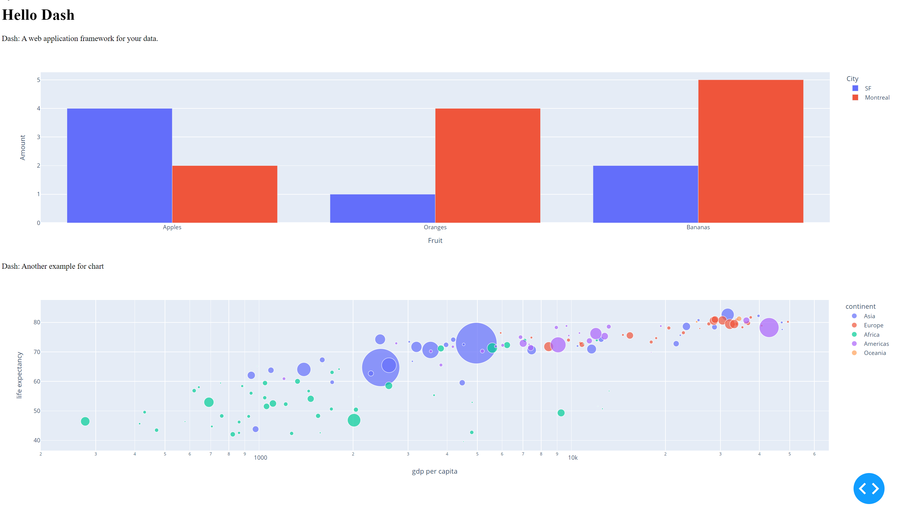

# stats-dash
class project for stats 507. we create a web application to view data

# steps to run app (windows) for the first time

in your terminal navigate to the project folder

type `py -V:3.9 -m venv .venv`

then type `.venv\Scripts\Activate.ps1`

you might have to enable script running with powershell

`Set-ExecutionPolicy -Scope CurrentUser RemoteSigned `

then run `pip install -r .\requirements.txt`

in the same terminal run

`python main.py`

# steps to run all other times (windows)

in your terminal navigate to the project folder
then type `.venv\Scripts\Activate.ps1`
in the same terminal run
`python main.py`

The website is now running on your computer

this is what the app should look like the first time

In the terminal, type ctrl-c to stop the website running on your computer